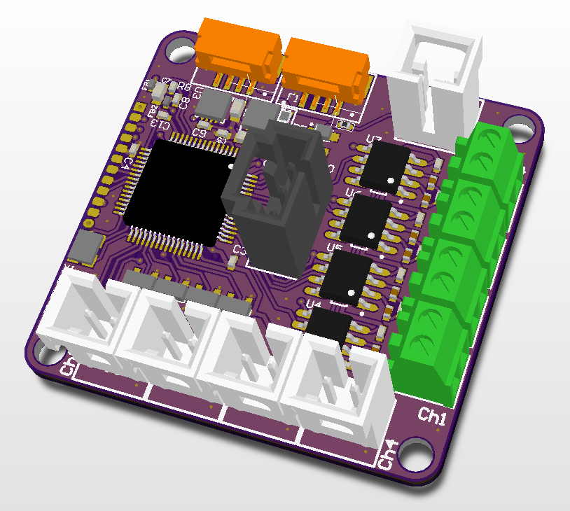

# Engine Monitor

## Overview

The [Avionics Anonymous Engine Monitor] interfaces with common engine sensors. It provides 4x 0-5V analog inputs, 4x thermocouple inputs, and an RPM input. Connects to Pixhawk and other similar autopilots via UAVCAN. Comes fully assembled, ready to use!

**Note:** This device currently requires custom development to integrate with most autopilot software. Please contact us if you need assistance.

### What makes it special?

* 4x 0-5V analog inputs (with under- and over-voltage protection)
* 4x thermocouple inputs (K-type by default)
* 1x RPM input for connection to hall-effect sensors or output from electronic ignition systems
* Customized software configuration for your application
* Robust UAVCAN interface is compatible with most Pixhawks and similar autopilots
* Update firmware via CAN interface

### Specifications

* Weight: x.x grams  
* Size: 1.65in x 1.59in x 0.5in  
* Input Power: 4.0V to 5.5V, XXmA  

### Required Accessories

* [CAN Harness](https://www.tindie.com/products/avionicsanonymous/uavcan-interconnect-cable/) - connects between the autopilot and a CAN node and between each CAN node on the bus
* [CAN Terminator](https://www.tindie.com/products/avionicsanonymous/uavcan-jst-terminator/) - connects to the last device on the CAN bus

### Where to Buy

* Coming soon! Contact us to order now.

## User Guide

### Wiring

The Engine Monitor is connected to your autopilot via CAN bus. The wiring is per the pinout below, or the necessary cables can be purchased to connect to your system right out of the box:

* [CAN Harness](https://www.tindie.com/products/avionicsanonymous/uavcan-interconnect-cable/) - connects between the autopilot and a CAN node and between each CAN node on the bus
* [CAN Terminator](https://www.tindie.com/products/avionicsanonymous/uavcan-jst-terminator/) - connects to the last device on the CAN bus

Analog inputs are connected to each of 4x Molex SL 2-pin locking headers. Polarity is marked on the board.  

Thermocouples are connected to each of 4x screw-terminal blocks. Polarity is marked on the board.  

The RPM signal is connected to a Molex SL 2-pin locking header. Polarity is marked on the board.  

#### Pinouts

**CAN Connector**

| Pin | Name | Description |
| :--- | :--- | :--- |
| 1 | POWER\_IN | Power Supply. 4.0-5.5V supported, but must also be compatible with connected laser. |
| 2 | CAN\_H | CAN high |
| 3 | CAN\_L | CAN low |
| 4 | GND | Signal/power ground. |

**Analog Input Connectors (4x)**

| Pin | Name | Description |
| :--- | :--- | :--- |
| 1 | S | Voltage signal |
| 2 | G | Ground|

**Thermocouple Input Connectors (4x)**

| Pin | Name | Description |
| :--- | :--- | :--- |
| 1 | Y | Yellow (K-type) |
| 2 | R | Red (K-type) |

**RPM Input Connector**

| Pin | Name | Description |
| :--- | :--- | :--- |
| 1 | S | Signal |
| 2 | G | Ground |

### Configuration

#### Autopilot Configuration

Currently, this device is not natively supported by common autopilots, and the firmware of this device itself is customized to your needs. We can set it up to publish CircuitStatus, FuelStatus, Temperature, RPM, or any other default UAVCAN messages, or define your own DSDL and we'll integrate it. Add your own support for processing these UAVCAN messages in your autopilot, or get in touch with us to ask about developing this support for you.

#### Node Configuration

The Engine Monitor node has a number of parameters accessible via the UAVCAN interface. These may be set following the steps outlined [here](../general/parameters.md)

**Parameters**

| Parameter Name | Description | Default Value | Allowable Values |
| :--- | :--- | :--- | :--- |
| node\_id | Node ID for this device | XXX | 1-125 |

## Firmware

### Release Notes

#### v1.0

* Initial Release