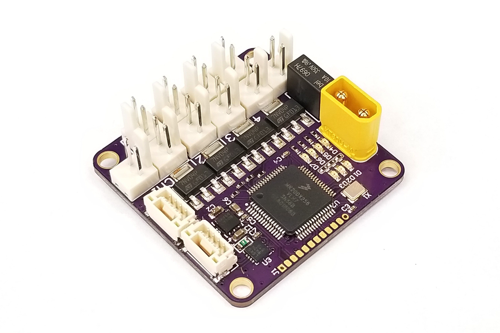

# Light Controller

## Overview

The [Avionics Anonymous Light Controller](https://www.avionicsanonymous.com/product-page/uavcan-light-controller) is a 4-channel light controller for unmanned vehicles. Each channel can be configured as a nav, strobe, beacon or landing light and can be programmed for various patterns. When connected to an autopilot running PX4, lights are automatically controlled based on the state of the autopilot! For example, beacons can be set to turn on when the system is prearmed and strobes to turn on when the system is armed, while nav lights may always be on. All of this is configurable via PX4 and UAVCAN parameters. The device interfaces to your autopilot via robust UAVCAN interface - much easier than trying to tune a PWM signal to give you the desired patterns using typical R/C light controllers.

### What makes it special?

* Designed for drop-in use with uniLight LED products
* Supports up to 30V lighting voltage
* Supports common-anode lights \(combined lights that use the same power pin for multiple LED's\)
* 4 separately-controllable channels supporting 3A each with a total limit of 10A.
* 3x connectors for 2 channels, 2x connectors for the other 2 channels means you can plug in multiple lights without having to splice
* Robust UAVCAN interface is compatible with most Pixhawks and similar autopilots
* Mount with screws through mounting holes
* Update firmware via CAN interface

### Specifications

* Weight: XX grams  
* Size: XXin x XXin x XXin  
* Power: 4.0V to 5.5V, XXmA  

### Required Accessories

* [CAN Harness](https://www.avionicsanonymous.com/product-page/uavcan-interconnect-cable) - connects between the autopilot and a CAN node and between each CAN node on the bus
* [CAN Terminator](https://www.avionicsanonymous.com/product-page/uavcan-terminator) - connects to the last device on the CAN bus

#### Where to Buy

* [Avionics Anonymous Store](https://www.avionicsanonymous.com/product-page/uavcan-light-controller)

## User Guide

### Wiring

The Light Controller is connected to your autopilot via CAN bus. The wiring is per the pinout below, or the necessary cables can be purchased to connect to your system right out of the box:

* [CAN Harness](https://www.avionicsanonymous.com/product-page/uavcan-interconnect-cable) - connects between the autopilot and a CAN node and between each CAN node on the bus
* [CAN Terminator](https://www.avionicsanonymous.com/product-page/uavcan-terminator) - connects to the last device on the CAN bus

#### Pinouts

**CAN Connector**

| Pin | Name | Description |
| :--- | :--- | :--- |
| 1 | POWER\_IN | Power supply. 4.0-5.5V supported. |
| 2 | CAN\_H | CAN high |
| 3 | CAN\_L | CAN low |
| 4 | GND | Signal/power ground. |

**Power Input Connector**

| Pin | Name | Description |
| :--- | :--- | :--- |
| 1 | POWER\_IN | Light power supply. 5-30V supported. |
| 2 | GND | Light power ground. |

**Light Output Connector**

| Pin | Name | Description |
| :--- | :--- | :--- |
| 1 | POWER\_IN | Light power output. |
| 2 | GND | Light power ground. |

### Mounting

#### Attachment

The Light Controller includes 4x screw holes for 4-40/M3 screws. Consider using standoffs or otherwise spacing the board off of flat surfaces to protect the pins which protrude through the bottom side.

### Configuration

#### Autopilot Configuration

**PX4 \(Support coming soon\)**

Several autopilot parameters must be set using QGC or similar:

* UAVCAN must be enabled by setting _UAVCAN\_ENABLE_ non zero. Set this to 1 for basic functionality or 2 to allow the device's UAVCAN parameters to be accessed via QGC.
* Set the operating mode for each light using the parameters _UAVCAN\_LGT\_ANTCL_, _UAVCAN\_LGT\_STROB_, _UAVCAN\_LGT\_NAV_, and _UAVCAN\_LGT\_LAND_, as follows:

  | Param Value | Description |
  | :--- | :--- |
  | 0 | Lights never on |
  | 1 | Lights on when system is armed |
  | 2 | Lights on when system is prearmed \(safety switch "unsafe"\) |
  | 3 | Lights always on |

#### Node Configuration

The Light Controller node has a number of parameters accessible via the UAVCAN interface. These may be set following the steps outlined [here](../general/parameters.md)

**Parameters**

| Parameter Name | Description | Default Value | Allowable Values |
| :--- | :--- | :--- | :--- |
| node\_id | Node ID for this device | 111 | 1-125 |
| chan\_1\_id | UAVCAN "SingleLightCommand" "light\_id" value for channel 1 | LIGHT\_ID\_RIGHT\_OF\_WAY \(nav lights\) | 0-255 |
| chan\_2\_id | UAVCAN "SingleLightCommand" "light\_id" value for channel 2 | LIGHT\_ID\_STROBE | 0-255 |
| chan\_3\_id | UAVCAN "SingleLightCommand" "light\_id" value for channel 3 | LIGHT\_ID\_LANDING | 0-255 |
| chan\_4\_id | UAVCAN "SingleLightCommand" "light\_id" value for channel 4 | LIGHT\_ID\_ANTI\_COLLISION \(beacon\) | 0-255 |
| chan\_1\_pattern | Pattern for channel 1. See "Patterns" table below. | 5 \(always on\) | 0-255 |
| chan\_2\_pattern | Pattern for channel 2. See "Patterns" table below. | 1 \(strobe, double flash\) | 0-255 |
| chan\_3\_pattern | Pattern for channel 3. See "Patterns" table below. | 5 \(always on\) | 0-255 |
| chan\_4\_pattern | Pattern for channel 4. See "Patterns" table below. | 3 \(beacon, single-flash\) | 0-255 |

_**Patterns**_

| Pattern Value | Pattern Name | Description |
| :--- | :--- | :--- |
| 0 | ALWAYS\_OFF | Lights off, regardless of command signal from autopilot |
| 1 | STROBE\_DOUBLE | Double flash at 1Hz |
| 2 | STROBE\_GLOW\_DOUBLE | Strobe, double flash, but low-intensity constant light when not strobing |
| 3 | BEACON | Single flash at 1Hz, opposite phase to strobe |
| 4 | BEACON\_SOFT | Soft 0.5Hz flash |
| 5 | ALWAYS\_ON | Constantly on when commanded on |

## Firmware

### Release Notes

#### v1.0

* Initial Release

