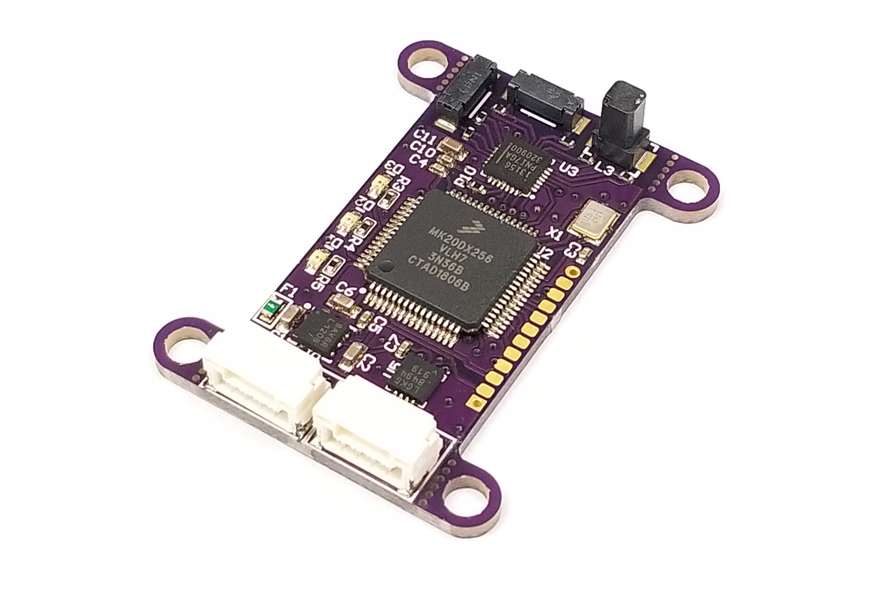
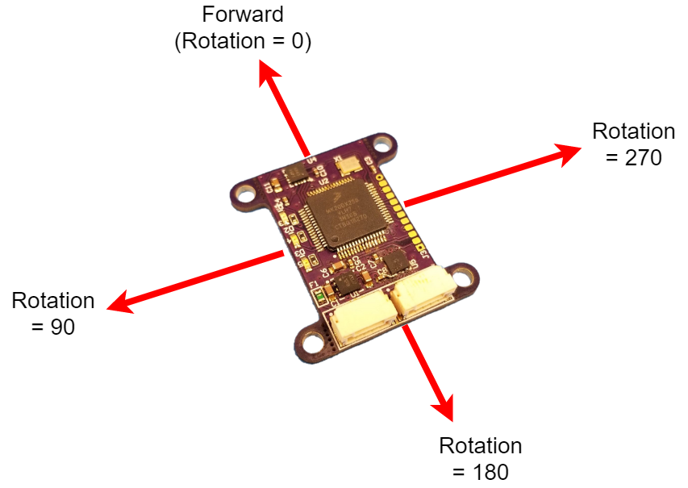

# MaxiMag

## Overview

The [Avionics Anonymous MaxiMag Magnetometer](https://www.avionicsanonymous.com/product-page/uavcan-high-quality-magnetometer) is a high-precision magnetometer for small unmanned aircraft. It includes a high-quality PNI RM3100 magnetometer enabling sub-1-degree heading accuracy and no variation with temperature. This interfaces to your autopilot via robust UAVCAN interface - no sketchy I2C wiring for your magnetometer!

### What makes it special?

* Extremely high-quality RM3100 magnetometer IC allows better than 1-degree heading accuracy in low-interference installations
* Coil sensors are inherently insensitive to temperature, displaying no offset drift unlike typical IC magnetometers
* Robust UAVCAN interface is compatible with most Pixhawks and similar autopilots and makes it safe to install your laser far away from the autopilot, wherever is convenient!
* Mount with screws through mounting ears or snip them off and foam tape it to your airframe
* Update firmware via CAN interface

### Specifications

* Weight: <4 grams  
* Size: 1.50in x 0.75in x 0.25in  
* Power: 4.0V to 5.5V, XXmA  

### Required Accessories

* [CAN Harness](https://www.avionicsanonymous.com/product-page/uavcan-interconnect-cable) - connects between the autopilot and a CAN node and between each CAN node on the bus
* [CAN Terminator](https://www.avionicsanonymous.com/product-page/uavcan-terminator) - connects to the last device on the CAN bus

#### Where to Buy

* [Avionics Anonymous Store](https://www.avionicsanonymous.com/product-page/uavcan-high-quality-magnetometer)

## User Guide

### Wiring

The MaxiMag is connected to your autopilot via CAN bus. The wiring is per the pinout below, or the necessary cables can be purchased to connect to your system right out of the box:

* [CAN Harness](https://www.avionicsanonymous.com/product-page/uavcan-interconnect-cable) - connects between the autopilot and a CAN node and between each CAN node on the bus
* [CAN Terminator](https://www.avionicsanonymous.com/product-page/uavcan-terminator) - connects to the last device on the CAN bus

#### Pinouts

**CAN Connector**

| Pin | Name | Description |
| :--- | :--- | :--- |
| 1 | POWER\_IN | Power Supply. 4.0-5.5V supported. |
| 2 | CAN\_H | CAN high |
| 3 | CAN\_L | CAN low |
| 4 | GND | Signal/power ground. |

### Mounting

#### Attachment

The MaxiMag can be mounted several ways. It includes 4x screw holes for 4-40/M3 screws. If using screws, make sure to use aluminum or otherwise non-ferrous screws! You can also simply adhere it to your vehicle with double-sided tape, and if doing so, you can cut off the mounting ears to save some weight and space.

#### Orientation 

The MaxiMag is normally mounted with the "flat" side down (components on the board pointed up) and the connector-end of the board pointed toward the back of your vehicle. 

It can, however, be mounted in any orientation. If mounted flat-side-down and only rotated in yaw, you can use the built-in rotation parameter to adjust for this. Enter the value (in degrees) that the board is rotated in yaw. For example, if the connector-end of the board points toward the left side of your vehicle, enter "90" for rotation.

For mounting orientations other than simple yaw, please use the external mag rotation settings in your autopilot to match your mounting. 

### Configuration

#### Autopilot Configuration

**PX4**

Several autopilot parameters must be set using QGC or similar:

* UAVCAN must be enabled by setting _UAVCAN\_ENABLE_ non zero. Set this to 1 for basic functionality or 2 to allow the device's UAVCAN parameters to be accessed via QGC.

#### Node Configuration

The MaxiMag node has a number of parameters accessible via the UAVCAN interface. These may be set following the steps outlined [here](../general/parameters.md)

**Parameters**

| Parameter Name | Description | Default Value | Allowable Values |
| :--- | :--- | :--- | :--- |
| node\_id | Node ID for this device | 102 | 1-125 |
| rotation | Board rotation in degrees | 0 | 0-360 |

## Firmware

### Release Notes

#### v1.4

* Initial Release

