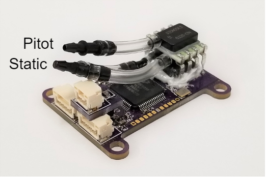

# MicroADC

## Overview

The [Avionics Anonymous MicroADC Air Data Computer](https://www.tindie.com/products/avionicsanonymous/uavcan-air-data-computer-airspeed-sensor/) is a tiny, richly-featured Air Data Computer \(ADC\) for small unmanned airplanes. Includes an MS5611 barometric pressure sensor for 10cm-resolution altitude, a Honeywell RSC-series differential pressure transducer for extremely accurate airspeed, and a thermistor interface with high-resolution convertor for air temperature measurement with less than 1 degree precision. All of this interfaces to your autopilot via robust UAVCAN interface - no sketchy I2C wiring! Comes fully assembled, ready to use!

### What makes it special?

* High-resolution, temperature-compensated airspeed sensor - low-range models are accurate to fractions of a knot!
* Sealed barometer case with port for plumbing to proper static source
* Onboard heaters keep barometer in accurate sensing range, even when it's below freezing outside!
* True air temperature measurement via included OAT probe
* Onboard computer calculates air density and true airspeed
* Robust UAVCAN interface is compatible with most Pixhawks and similar autopilots and makes it safe to install this out in a wing or wherever is convenient!
* Update firmware via CAN interface

### Specifications

* Weight: XX grams
* Size: XX x XX x XX
* Power: 4.0V to 5.5V, XXmA

### Required Accessories

* [CAN Harness](https://www.tindie.com/products/avionicsanonymous/uavcan-interconnect-cable/) - connects between the autopilot and a CAN node and between each CAN node on the bus
* [CAN Terminator](https://www.tindie.com/products/avionicsanonymous/uavcan-jst-terminator/) - connects to the last device on the CAN bus

#### Where to Buy

* [Tindie](https://www.tindie.com/products/avionicsanonymous/uavcan-air-data-computer-airspeed-sensor/)

## User Guide

### Wiring

The MicroADC is connected to your autopilot via CAN bus. The wiring is per the pinout below, or the necessary cables can be purchased to connect to your system right out of the box:

* [CAN Harness](https://www.tindie.com/products/avionicsanonymous/uavcan-interconnect-cable/) - connects between the autopilot and a CAN node and between each CAN node on the bus
* [CAN Terminator](https://www.tindie.com/products/avionicsanonymous/uavcan-jst-terminator/) - connects to the last device on the CAN bus

#### Pinouts

**CAN Connector**

| Pin | Name | Description |
| :--- | :--- | :--- |
| 1 | POWER\_IN | Power Supply. 4.0-5.5V supported. |
| 2 | CAN\_H | CAN high |
| 3 | CAN\_L | CAN low |
| 4 | GND | Signal/power ground. |

**OAT Connector**

| Pin | Name | Description |
| :--- | :--- | :--- |
| 1 | Thermistor | Included OAT thermistor |
| 2 | Thermistor | Included OAT thermistor |

### Plumbing

The MicroADC must be plumbed to a clean source of both pitot and static pressure. Typically, this is accomplished via a pitot/static probe, but a static source can also be installed in a carefully-chosen location on the fuselage.

Two barbed fittings are provided to connect to 1/16" ID tubing. The upper barb, which connects only to the differential pressure transducer, is for pitot pressure. The lower barb, which connects to both the differential pressure transducer and barometer, is for static pressure.

### Configuration

#### Autopilot Configuration

**PX4**

Several autopilot parameters must be set using QGC or similar:

* UAVCAN must be enabled by setting _UAVCAN\_ENABLE_ non zero. Set this to 1 for basic functionality or 2 to allow the device's UAVCAN parameters to be accessed via QGC.

#### Node Configuration

The MicroADC node has a number of parameters accessible via the UAVCAN interface. These may be set following the steps outlined [here](../general/parameters.md)

**Parameters**

| Parameter Name | Description | Default Value | Allowable Values |
| :--- | :--- | :--- | :--- |
| node\_id | Node ID for this device | 101 | 1-125 |
| autozero\_time | Time in seconds from boot at which airspeed sensor is zeroed | 5 | 0-360 |
| pub\_airspeed | Enable/Disable publish of calculated indicated and true airspeed | 0 | 0-1 |
| pub\_raw\_press | Enable/Disable publish of raw differential pressure | 1 | 0-1 |

_**Notes on airspeed vs raw pressure**_

The MicroADC is capable of publishing calculated indicated and true airspeed based on its sensors. This is valuable for systems which don't have other means to compute these values. However, the PX4 autopilot system is build on an old assumption that only raw pressure is provided, so their existing data flow and sensor validation works better if only raw pressure is provided. The autopilot will still use the highly-accurate pressure and air temperature measurements from the microADC to calculate indicated and true airspeed at identical accuracy to that computed within the air data computer. For this reason, when using PX4, we suggest leaving the default settings - "pub\_airspeed" set to 0 and "pub\_raw\_press" set to 1.

## Firmware



### Release Notes

#### v1.1

* Fix CAN transfer bug that could cause intermittent bus lockups

#### v1.0

* Initial Release

