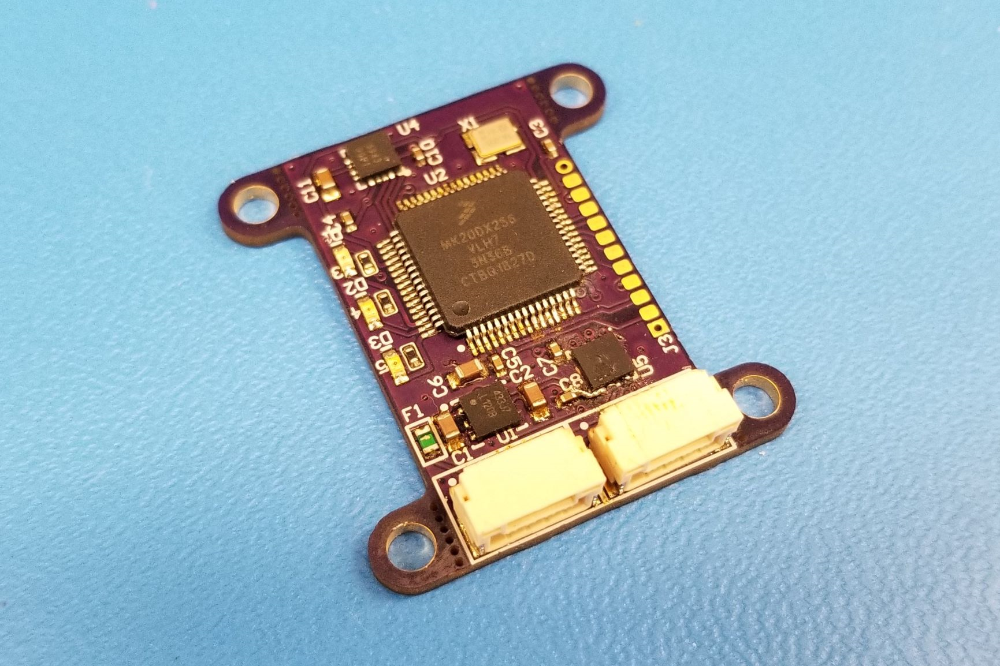

# MiniMag

## Overview

The [Avionics Anonymous MiniMag Magnetometer](https://www.tindie.com/products/avionicsanonymous/uavcan-magnetometer/) is a high-precision magnetometer for small unmanned aircraft. it includes a high-quality Memsic MMC5983MA magnetometer enabling sub-1-degree heading accuracy. This interfaces to your autopilot via robust UAVCAN interface - no sketchy I2C wiring for your magnetometer!

### What makes it special?

* Extremely high-quality Memsic magnetometer IC allows ~0.5deg heading accuracy in low-interference installations
* Robust UAVCAN interface is compatible with most Pixhawks and similar autopilots and makes it safe to install your laser far away from the autopilot, wherever is convenient!
* Mount with screws through mounting ears or snip them off and foam tape it to your airframe
* Update firmware via CAN interface

### Specifications

* Weight: 3.2 grams  
* Size: 1.25in x 0.75in x 0.25in  
* Power: 4.0V to 5.5V, XXmA  

### Required Accessories

* [CAN Harness](https://www.tindie.com/products/avionicsanonymous/uavcan-interconnect-cable/) - connects between the autopilot and a CAN node and between each CAN node on the bus
* [CAN Terminator](https://www.tindie.com/products/avionicsanonymous/uavcan-jst-terminator/) - connects to the last device on the CAN bus

#### Where to Buy

* [Tindie](https://www.tindie.com/products/avionicsanonymous/uavcan-magnetometer/)

## User Guide

### Wiring

The MiniMag is connected to your autopilot via CAN bus. The wiring is per the pinout below, or the necessary cables can be purchased to connect to your system right out of the box:

* [CAN Harness](https://www.tindie.com/products/avionicsanonymous/uavcan-interconnect-cable/) - connects between the autopilot and a CAN node and between each CAN node on the bus
* [CAN Terminator](https://www.tindie.com/products/avionicsanonymous/uavcan-jst-terminator/) - connects to the last device on the CAN bus

#### Pinouts

**CAN Connector**

| Pin | Name | Description |
| :--- | :--- | :--- |
| 1 | POWER\_IN | Power Supply. 4.0-5.5V supported. |
| 2 | CAN\_H | CAN high |
| 3 | CAN\_L | CAN low |
| 4 | GND | Signal/power ground. |

### Configuration

#### Autopilot Configuration

**PX4**

Several autopilot parameters must be set using QGC or similar:

* UAVCAN must be enabled by setting _UAVCAN\_ENABLE_ non zero. Set this to 1 for basic functionality or 2 to allow the device's UAVCAN parameters to be accessed via QGC.

#### Node Configuration

The MiniMag node has a number of parameters accessible via the UAVCAN interface. These may be set following the steps outlined [here](../general/parameters.md)

**Parameters**

| Parameter Name | Description | Default Value | Allowable Values |
| :--- | :--- | :--- | :--- |
| node\_id | Node ID for this device | 102 | 1-125 |
| rotation | Board rotation in degrees | 0 | 0-360 |
| update\_rate\_hz | Rate at which magnetic field data is published in Hz | 30 | 1-30 |
| auto\_mag\_set | Enable [auto temperature compensation](minimag.md#automatic-temperature-compensation) | 0 | 0-1 |

**Automatic Temperature Compensation**

Setting the "auto\_mag\_set" parameter to 1 enables an experimental automatic temperature compensation. When enabled, every 10 seconds, the unit evaluates its internal temperature. if it has changed too much, the unit performs an automatic reset and set of the polarity of the sensing film and uses this to update thermal correction offsets. If the sensor undergoes significant changes in ambient temperature, this can dramatically improve stability and accuracy of its output, but also leads to small step changes in the magnetic field output when the offsets are updated. This will pose no issue for PX4 autopilots which fuse magnetic data into a Kalman filter, but you should ensure this behavior is safe in your application. Please contact us for more information.

**Warning** This feature has not been thoroughly vetted and is considered experimental! Use at your own risk.

## Firmware

### Release Notes

#### v1.2

* Improved firmware version reporting via CAN to support PX4-based firmware update
* Fix timer rollover issue which could cause a failed mag sample every ~72 minutes

#### v1.0

* Initial Release

