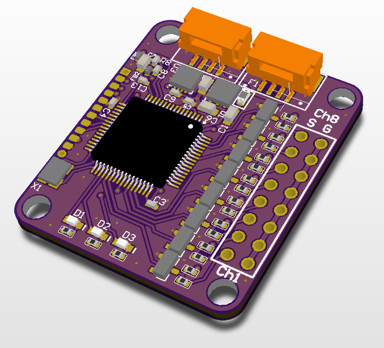

# Voltage Monitor

## Overview

The [Avionics Anonymous Voltage Monitor] is a small 8-channel analog input unit. It allows measurement of analog sensors or monitoring of multiple batteries, voltage regulators, solar cells, etc - any 8 voltage sources that share a common ground. Connects to Pixhawk and other similar autopilots via UAVCAN. Comes fully assembled, ready to use!

**Note:** This device currently requires custom development to integrate with most autopilot software. Please contact us if you need assistance.

### What makes it special?

* 8 separate voltage inputs (common ground)
* Inputs are protected against under- and over-voltage
* Units are built to order with your preferred voltage range for each channel
* Publishes 8x standard UAVCAN "CircuitStatus" messages
* Robust UAVCAN interface is compatible with most Pixhawks and similar autopilots
* Update firmware via CAN interface

**Note:** Because the inputs share a common ground, this unit cannot be used to monitor series cell voltages in a battery.

### Specifications

* Weight: x.x grams  
* Size: 1.15in x 1.35in x 0.25in  
* Input Power: 4.0V to 5.5V, XXmA  

### Required Accessories

* [CAN Harness](https://www.tindie.com/products/avionicsanonymous/uavcan-interconnect-cable/) - connects between the autopilot and a CAN node and between each CAN node on the bus
* [CAN Terminator](https://www.tindie.com/products/avionicsanonymous/uavcan-jst-terminator/) - connects to the last device on the CAN bus

### Where to Buy

* Coming soon! Contact us to order now.

## User Guide

### Wiring

The Voltage Monitor is connected to your autopilot via CAN bus. The wiring is per the pinout below, or the necessary cables can be purchased to connect to your system right out of the box:

* [CAN Harness](https://www.tindie.com/products/avionicsanonymous/uavcan-interconnect-cable/) - connects between the autopilot and a CAN node and between each CAN node on the bus
* [CAN Terminator](https://www.tindie.com/products/avionicsanonymous/uavcan-jst-terminator/) - connects to the last device on the CAN bus

Analog inputs are connected to channels 1-8 on the 8x2 header. The 8 ground pins, closest to the edge of the board, are tied to a common ground.

#### Pinouts

**CAN Connector**

| Pin | Name | Description |
| :--- | :--- | :--- |
| 1 | POWER\_IN | Power Supply. 4.0-5.5V supported, but must also be compatible with connected laser. |
| 2 | CAN\_H | CAN high |
| 3 | CAN\_L | CAN low |
| 4 | GND | Signal/power ground. |

**Input Connectors (8x)**

| Pin | Name | Description |
| :--- | :--- | :--- |
| 1 | S | Voltage signal |
| 2 | G | Ground|

### Configuration

#### Autopilot Configuration

Currently, this device is not natively supported by common autopilots. Add your own support for UAVCAN devices publishing "CircuitStatus" messages, or get in touch with us to ask about developing this support for you.

#### Node Configuration

The Voltage Monitor node has a number of parameters accessible via the UAVCAN interface. These may be set following the steps outlined [here](../general/parameters.md)

**Parameters**

| Parameter Name | Description | Default Value | Allowable Values |
| :--- | :--- | :--- | :--- |
| node\_id | Node ID for this device | XXX | 1-125 |

## Firmware

### Release Notes

#### v1.0

* Initial Release