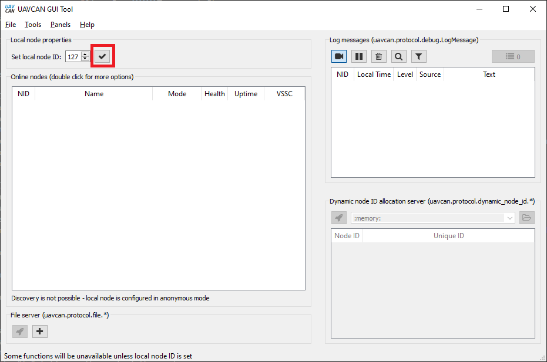
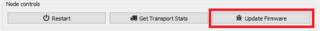

# Firmware Update

The firmware on all AvAnon UAVCAN nodes can be updated via their UAVCAN interface. Make sure to keep your devices updated for the best performance! Firmware download links and release notes can be found near the bottom of each device page.

## Updating using UAVCAN GUI and SLCAN tool

1. Download the latest firmware for your AvAnon node, save it somewhere accessible on your computer, and unzip the folder.
2. Install the [UAVCAN GUI](https://github.com/UAVCAN/gui_tool)
3. Connect your [SLCAN tool](https://zubax.com/products/babel) to your computer
4. Open the UAVCAN GUI and select your SLCAN tool

   

5. Set your local Node ID and click the "check" button

   

6. Connect your AvAnon node to your SLCAN tool
   * The node should appear in the GUI "Online Nodes" list

     
7. Double-click on the AvAnon node you want to update
   * A window like this should appear

     
8. Click on "Update Firmware"

   

9. You may get a warning that no dynamic ID server is running that asks if you want to continue. Select "yes".
10. Navigate to the AvAnon firmware file you downloaded earlier and select "open"

    **Warning** Make sure you select the correct firmware file for this node! Using this method, there is no protection against flashing firmware for the wrong node.

11. Sit back and wait!
    * You should see the node "Mode" switch to "SOFTWARE UPDATE"
    * The LED's on your AvAnon node should flash yellow/red alternately
    * Periodically, updates will appear in the GUI "Log Messages" box showing download progress
12. When the firmware update is successful, the node will restart
    * The displayed "Mode" will return to operational
    * The node's LED will flash green

      **Note** Some devices \(like the GNSS\) may not restart cleanly and the LED may flash red. If this happens, disconnect and reconnect the node. It should start up normally.
13. Verify the expected version is displayed next to "Software Version"
    * If the version does not match what you tried to load, the upload may have failed. Certain CAN tools seem to provide more reliable transfers than others, and the firmware loader in early firmware versions is not very robust to dropped data. If it fails, disconnect your node and start again at step 6. With some tools, this may take several attempts. Upcoming firmware will improve the robustness of this update system. 

## Updating automatically using PX4-based autopilots

**Note** Not ready yet - check back soon!

